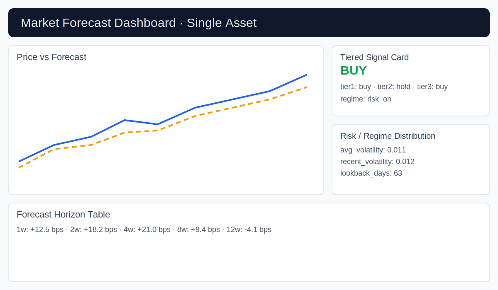
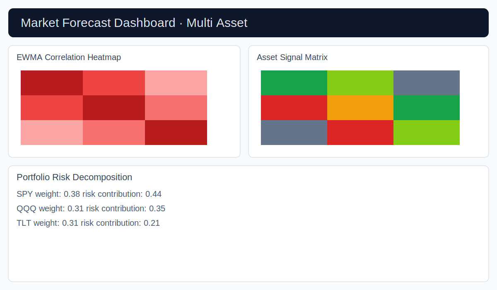

# market-forecast

`market-forecast` is a Python package for 1 to 12 week market movement forecasting with reusable time-series core components.

## Features in this MVP
- Single and multi-asset tabular ingestion (`pandas`)
- Feature generation for trend, seasonality, volatility, and technical indicators
- Model wrappers for ARIMA, EGARCH (via `arch`), and SVR
- Ensemble combiner with performance-weighted averaging
- Signal conversion to buy/hold/sell with tiered technical + ARIMA confirmation
- Walk-forward backtesting engine
- Regime-aware indicator scoring and signal selection
- Plotly dashboard builders for single and multi-asset outputs
- Colab-ready notebook in `notebooks/market_forecast_colab_demo.ipynb`

## Install

```bash
pip install -e .
```

Optional extras:

```bash
pip install -e .[market,dashboard,dev]
```


## Install from GitHub

Install directly from a GitHub repository (replace with your repo URL):

```bash
pip install "git+https://github.com/your-org/market_forecast_model.git"
```

Install a specific branch:

```bash
pip install "git+https://github.com/your-org/market_forecast_model.git@main"
```

Install a specific tag or commit:

```bash
pip install "git+https://github.com/your-org/market_forecast_model.git@v0.1.0"
# or
pip install "git+https://github.com/your-org/market_forecast_model.git@<commit_sha>"
```

If your repository is private, authenticate with a personal access token or SSH URL and ensure your environment has access rights.

## Quick start

```python
from market_forecast.pipelines.forecast_pipeline import ForecastPipeline
from market_forecast.config.schemas import ForecastConfig

config = ForecastConfig()
pipeline = ForecastPipeline(config=config)
pipeline.fit(prices_df)
pred = pipeline.predict(horizons=[1, 2, 4, 8, 12])
signals = pipeline.generate_signals(pred)
state = pipeline.summarize_current_state()
```


## Dashboard app entrypoint

Run the dashboard in Streamlit with serialized artifacts for predictions, signals, and state summary:

```bash
streamlit run src/market_forecast/dashboard/app.py
```

The sidebar includes an explicit mode selector:
- `Single Asset`: renders forecast horizon table, tiered signal card, and risk/regime distribution card.
- `Multi Asset`: renders EWMA correlation heatmap, asset signal matrix, and portfolio risk decomposition.

Expected artifact files:
- `artifacts/predictions.csv` (or `.json` / `.parquet`)
- `artifacts/signals.csv` (or `.json` / `.parquet`)
- `artifacts/state_summary.json`
- `artifacts/returns.csv` for multi-asset mode

### UI smoke test instructions

1. Install dashboard dependencies:
   ```bash
   pip install -e .[dashboard,dev]
   ```
2. Create sample artifacts (or use your pipeline output) in `artifacts/`.
3. Launch the app:
   ```bash
   streamlit run src/market_forecast/dashboard/app.py
   ```
4. Verify in **Single Asset** mode:
   - Price vs Forecast chart appears.
   - Forecast horizon table contains `horizon_weeks` and `predicted_move_bps`.
   - Tiered signal card shows overall/tier signals and regime.
   - Risk/regime distribution table is populated.
5. Switch to **Multi Asset** mode and verify:
   - EWMA correlation heatmap renders.
   - Asset signal matrix renders.
   - Portfolio risk decomposition table is populated and sorted by risk contribution.

### Screenshot artifacts

Single-asset dashboard mock:



Multi-asset dashboard mock:



## CLI

```bash
mforecast --help
```

## Colab
Open and run `notebooks/market_forecast_colab_demo.ipynb` in Google Colab.
